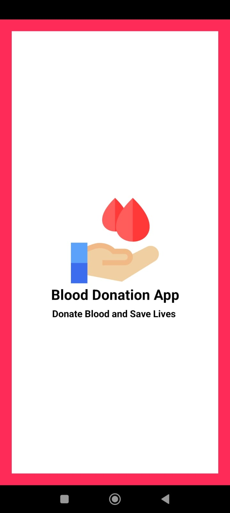
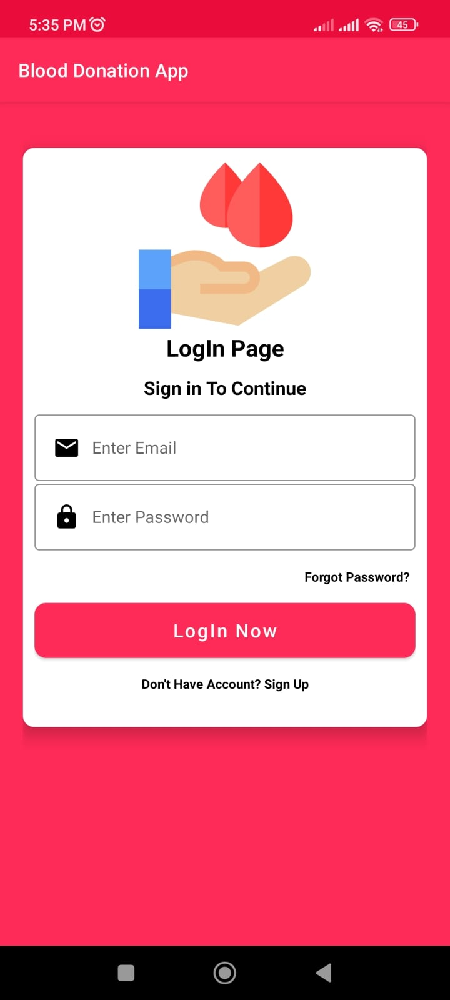
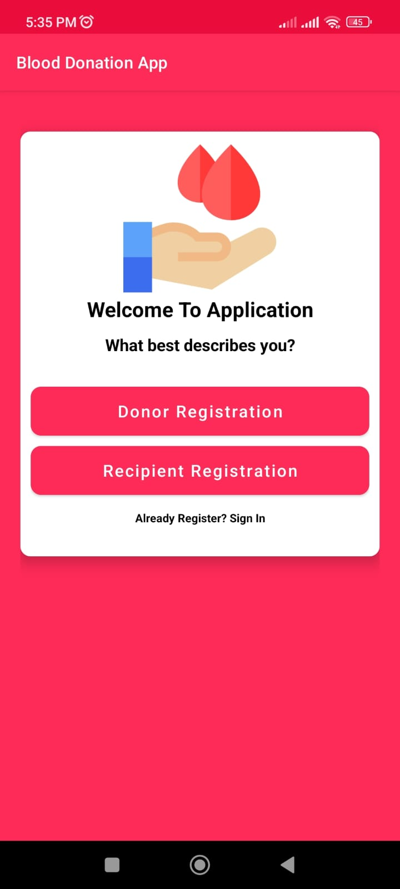
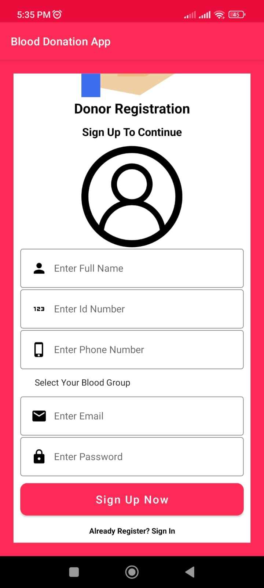

# Blood-Donation-App
* **All You Want To Know About Features Of Application You Will Find In This Section With Visuals**.
* Software & Technologies used (**Android Studio , AdobeXd , FireBase**).
* Application Contains Splash Screen with Animations of Text And Logo As Well.
* You will Find All The Images And Vector Assets Inside [**rec/drawable**] Folder.
* Appliaction Screens (**Splash Screen , SignIn Screen , Account Creation Screen , Blood Donor And Recipient Screen**);
* **Color Scheme** ( **Background Color #fe2a57 , Statusbar Color #EA0D3C**).
* **TextInputEditText Style**
* <style name="TextInputLayoutStyle" parent="Widget.MaterialComponents.TextInputLayout.OutlinedBox">

#
  
## App Screenshots
  
<!--   !-->

 
#  
 
## Developer
  
 <a href="https://github.com/Zohaib-Munir"> Zohaib Munir </a> 
#
